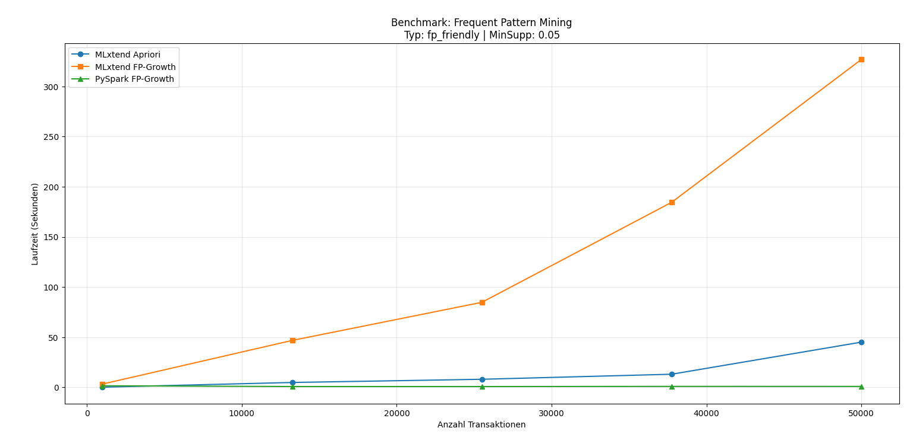
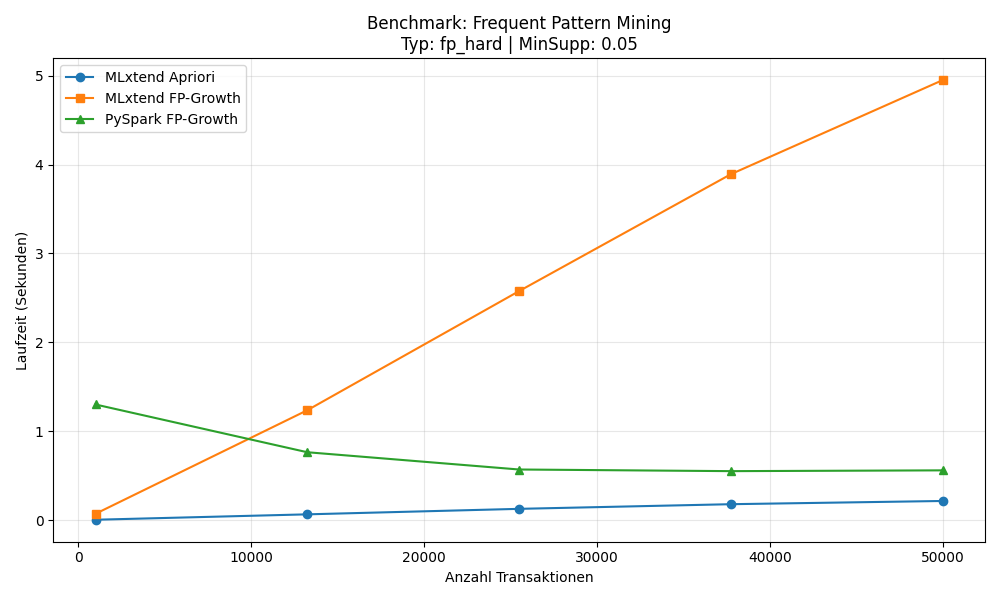
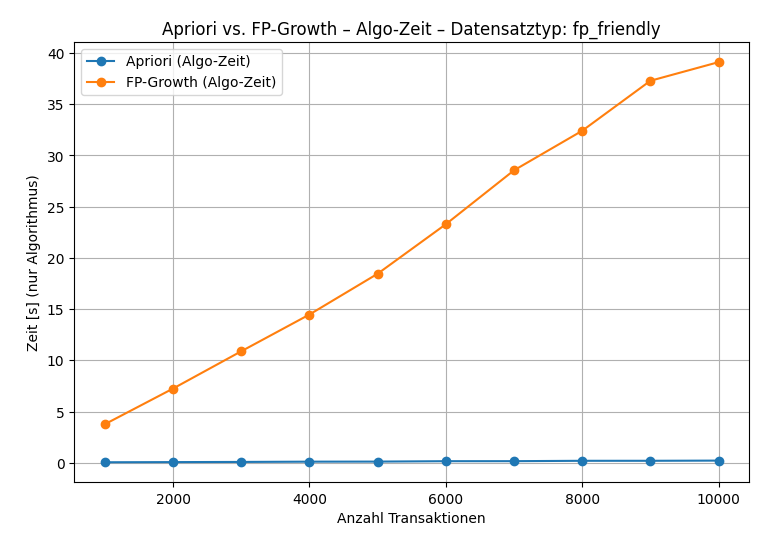
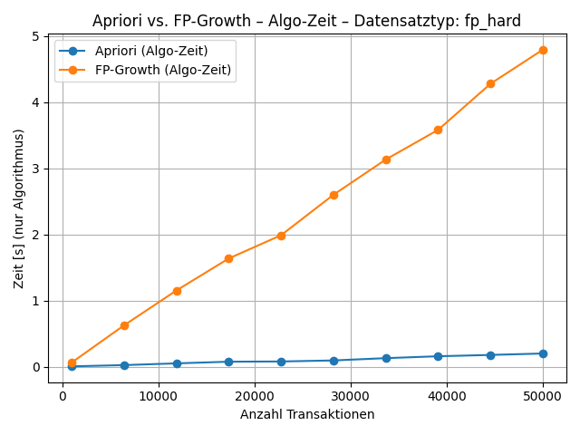
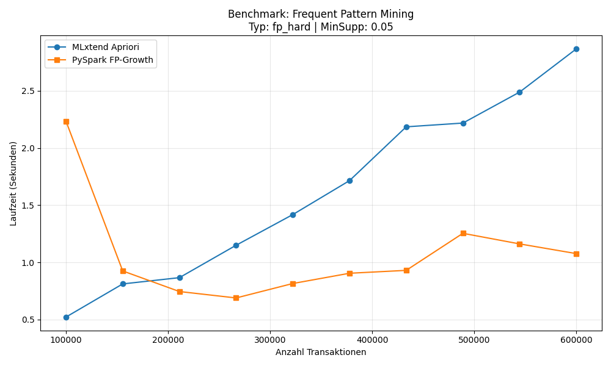
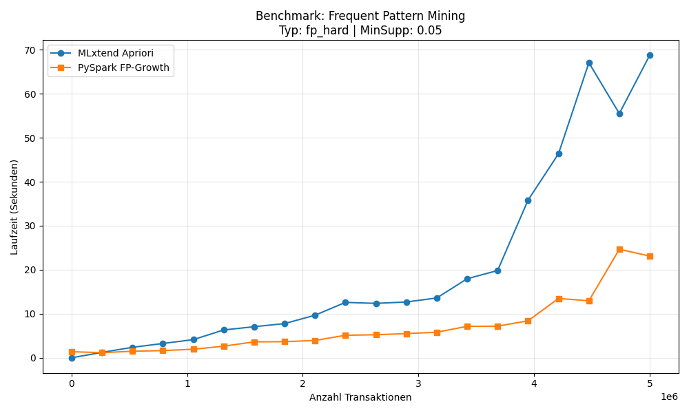
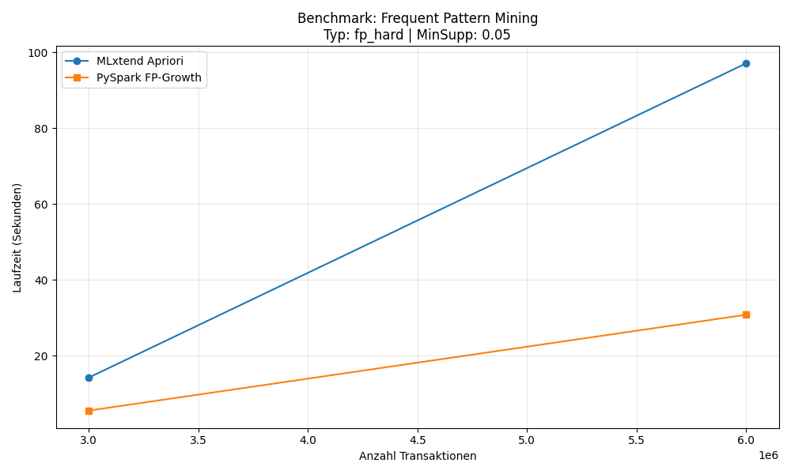

# FP-Growth vs Apriori

Projekt zum Benchmark von `apriori`, `fpgrowth` (mlxtend) und `PySpark FP-Growth`.

## Projektkontext und Beobachtungen

Im Zuge unserer Projekts zu Mining-Frameworks (DSR) für Assoziationsregeln mit Cybersecuritydaten auf Grundalge des Papers

> **A Fast Methodology to Find Decisively Strong Association Rules (DSR) by Mining Datasets of Security Records**
> _Claudia Cavallaro, Vincenzo Cutello, Mario Pavone, and Francesco Zito (University of Catania, Italy)_

haben wir die Performance von `apriori` mit `mlxtend`, `fpgrowth` mit `mlxtend` sowie `FP-Growth` mit `PySpark` untersucht und geplottet.

In unseren Tests lief `apriori` durch Vektorisierung überraschend effizient und robust, trotz Global
Interpreter Lock (GIL) in Python. `fpgrowth` aus `mlxtend` zeigte dagegen einen hohen Overhead durch die
Baumstruktur und performte in diesem Setup deutlich schlechter. `PySpark FP-Growth` lieferte die beste
Performance, setzt aber eine laufende JVM und damit eine entsprechend vorbereitete Umgebung voraus.

## Plot-Ergebnisse

Die Plots zeigen Laufzeit-Benchmarks bei wachsender Anzahl von Transaktionen. Je Setup wurden mehrere
Iterationen ausgefuehrt und die Datensatzgroesse pro Iteration zwischen einem Start- und Endwert variiert.

Namensschema der Dateien:
`<setup>_<datasettyp>_<iterationen>_<start>_<ende>.png`

Beispiel:
`mlPyFp_hard_5_0_50k.png`

- `mlPyFp`: `apriori` (mlxtend), `fpgrowth` (mlxtend) und `FP-Growth` (PySpark) im selben Versuch
- `hard`: Datensatz ist gezielt schwierig fuer FP-Growth
- `5`: 5 Iterationen
- `0_50k`: Bereich der Datensatzgroesse von 0 bis 50.000

Zusatz zu den Setups:

- `mlPyFp`: Vergleich `apriori` + `mlxtend fpgrowth` + `pyspark fpgrowth`
- `mlPy`: Vergleich `apriori` + `pyspark fpgrowth` (ohne `mlxtend fpgrowth`)

Datensatztypen im Versuch:

- `fp friendly`: Datensatz mit Merkmalsauspraegungen, bei denen aufgrund der Zusammensetzung
  definitiv Assoziationsregeln existieren.
- `fp hard`: Datensatz mit stark unterschiedlichen Merkmalsauspraegungen, bei denen keine
  relevanten Assoziationsregeln entstehen. Hier geht es vor allem darum, wie effizient die
  Algorithmen mit diesem schwierigen Fall umgehen.

### Alle Benchmark-Plots

`mlPyFp_friendly_5_0_50k.png`


`mlPyFp_hard_5_0_50k.png`


`mlPy_friendly_10_0_10k.png`


`mlPy_hard_10_0_500k.png`


`mlPy_hard_10_100k_600K.png`


`mlPy_hard_20_0_5mio.png`


`mlPy_hard_2_3mio_6mio.png`


## Venv erstellen (Windows / PowerShell)

1. In den Projektordner wechseln:

2. Virtuelle Umgebung anlegen:
   ```powershell
   python -m venv .venv
   ```
3. Venv aktivieren:

   ```powershell
   .\.venv\Scripts\Activate.ps1
   ```

4. Abhaengigkeiten installieren:
   ```powershell
   pip install numpy pandas matplotlib mlxtend pyspark
   ```

## Struktur

- `configuration.py`: zentrale Konfiguration und Start über Config
- `auto_plotting_benchmark.py`: Orchestrator
- `dataset_generation.py`: Datensatz-Erzeugung
- `benchmark_apriori.py`: Apriori-Benchmark
- `benchmark_fpgrowth.py`: MLxtend FP-Growth-Benchmark
- `benchmark_pyspark.py`: PySpark Setup + FP-Growth
- `plot.py`: Ausgabe-Tabelle + Plot

## Starten

- Über zentrale Config:
  ```powershell
  python .\configuration.py
  ```
- Oder direkt über den Runner:
  ```powershell
  python .\auto_plotting_benchmark.py
  ```

Anpassungen erfolgen in `configuration.py` (Klasse `BenchmarkConfig` / `CONFIG`).
